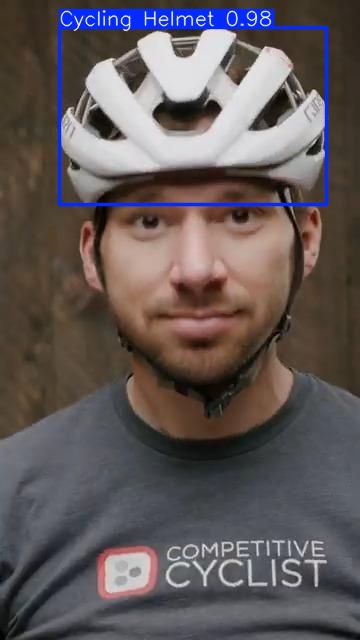

# Helmet_Detection_Using_YOLO


  

## 🚀 Project Overview
This project focuses on detecting helmet wearability in real-time using deep learning, specifically the **YOLOv11n** model. The goal is to support law enforcement, improve road safety, and enable automatic detection of motorcyclists without helmets.  

We leveraged **Roboflow** for dataset management and **Ultralytics YOLOv11** for building and training the model, with training performed in **Google Colab** using GPU acceleration.  

---

## 📚 Tech Stack
- **Programming Language**: Python  
- **Framework**: Ultralytics YOLOv11 (Nano Version - YOLOv11n)  
- **Dataset Source**: Roboflow Universe ([Link](https://universe.roboflow.com/yolo-do-it-yhopz/helmet-detector-9rzmg-bmd6q))  
- **Environment**: Google Colab, VS Code  
- **Libraries**: Ultralytics, Roboflow, IPython Kernel  

---

## 🛠️ Setup Instructions

### 1. Clone the Repository
```bash
git clone https://github.com/prateekfr/Helmet_Detection_Using_YOLO.git
cd Helmet_Detection_Using_YOLO
```

### 2. Install Dependencies
Make sure you have Python 3.8+ installed. Then run:
```bash
pip install -r requirements.txt
```

`requirements.txt` includes:
- ultralytics
- roboflow
- ipykernel

### 3. Update Roboflow Universe API Key

```python
from roboflow import Roboflow

rf = Roboflow(api_key="your_api_key_here")
project = rf.workspace("yolo-do-it-yhopz").project("helmet-detector-9rzmg-bmd6q")
version = project.version(1)
dataset = version.download("yolov11")
```

### 4. Training the YOLOv11n Model
```bash
!yolo task=detect mode=train data={dataset.location}/data.yaml model="yolo11n.pt" epochs=50 imgsz=640
```

### 5. Test on Videos or Images 

You can use the given sample jpeg and mp4 files for predictions.

---

## 🎯 Objectives
- Real-time helmet detection on motorcyclists.
- Deployment-ready model for smart traffic monitoring.
- Support safer roads through automated alerts and enforcement tools.

---

## 🧠 Model Details

| Model Variant | YOLOv11n (Nano) |
|:-------------|:----------------|
| Image Size    | 640 x 640 |
| Training Epochs | 50 |
| Optimizations | Data Augmentation, Real-time mAP monitoring |
| Evaluation Outputs | Confusion Matrix, Precision-Recall Curve, Label Distribution |

YOLOv11n was chosen for its **lightweight** nature and **real-time detection** capabilities with limited data.

---

## 📈 Results
- High accuracy with helmet/no-helmet classification.
- Minor false positives in highly cluttered or poor lighting environments.
- Visualizations like confusion matrix and precision-recall curves validate model performance.

---

## 🚧 Challenges Faced
- **Class imbalance**: More helmet-wearing instances than non-helmet ones.
- **Lighting and background variance** affected detection robustness.
- **Limited dataset size** requiring careful augmentation strategies.

---

## 🔮 Future Scope
- Deploy model on live traffic camera feeds.
- Extend detection to multiple classes (e.g., face masks, seat belts).
- Integrate automatic violation alert and reporting systems.

---

## 📚 References
- [Ultralytics YOLOv11 Documentation](https://docs.ultralytics.com)
- [Roboflow Universe](https://universe.roboflow.com)
- Object Detection Literature

---

## ✨ Acknowledgements
Special thanks to [Ultralytics](https://github.com/ultralytics) and [Roboflow](https://roboflow.com) for making cutting-edge AI tools accessible.

---

# 📸 Sample Output


